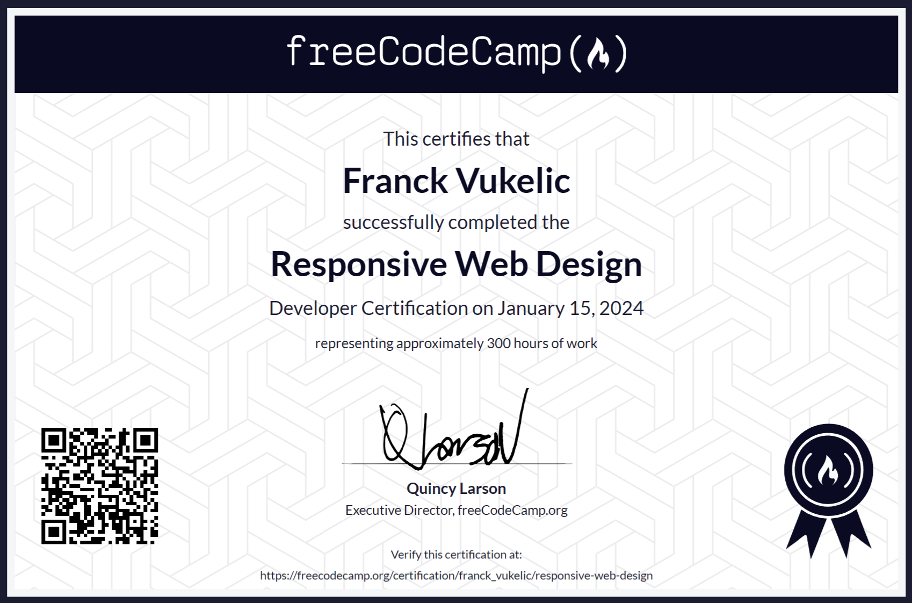

## [Responsive Web Design Certification](https://www.freecodecamp.org/learn/2022/responsive-web-design)

`[EN]`
In this Responsive Web Design Certification, you'll learn the languages that developers use to build webpages: HTML (Hypertext Markup Language) for content, and CSS (Cascading Style Sheets) for design.

First, you'll build a cat photo app to learn the basics of HTML and CSS. Later, you'll learn modern techniques like CSS variables by building a penguin, and best practices for accessibility by building a quiz site.

Finally, you'll learn how to make webpages that respond to different screen sizes by building a photo gallery with Flexbox, and a magazine article layout with CSS Grid.

---

`[FR]` Dans cette certification en Responsive Web Design, vous apprendrez les langages que les développeurs utilisent pour créer des pages web : HTML (Hypertext Markup Language) pour le contenu et CSS (Cascading Style Sheets) pour le design.

Tout d'abord, vous construirez une application de photos de chats pour apprendre les bases de HTML et CSS. Ensuite, vous apprendrez des techniques modernes comme les variables CSS en construisant un pingouin, et les meilleures pratiques en matière d'accessibilité en créant un site de quiz.

Enfin, vous apprendrez comment créer des pages web qui s'adaptent à différentes tailles d'écran en construisant une galerie de photos avec Flexbox, et une mise en page d'article de magazine avec CSS Grid.

---

### Module 1

```
1. Learn HTML by Building a Cat Photo App
2. Learn Basic CSS by Building a Cafe Menu
3. Learn CSS Colors by Building a Set of Colored Markers
4. Learn HTML Forms by Building a Registration Form
5. 🎓 Survey Form
```

### Module 2

```
1. Learn the CSS Box Model by Building a Rothko Painting
2. Learn CSS Flexbox by Building a Photo Gallery
3. Learn Typography by Building a Nutrition Label
4. Learn Accessibility by Building a Quiz
5. 🎓 Tribute Page
```

### Module 3

```
1. Learn More About CSS Pseudo Selectors By Building A Balance Sheet
2. Learn Intermediate CSS by Building a Cat Painting
3. Learn Responsive Web Design by Building a Piano
4. 🎓 Technical Documentation Page
```

### Module 4

```
1. Learn CSS Variables by Building a City Skyline
2. Learn CSS Grid by Building a Magazine
3. 🎓 Product Landing Page
```

### Module 5

```
1. Learn CSS Animation by Building a Ferris Wheel
2. Learn CSS Transforms by Building a Penguin
3. 🎓 Personal Portfolio Webpage
```